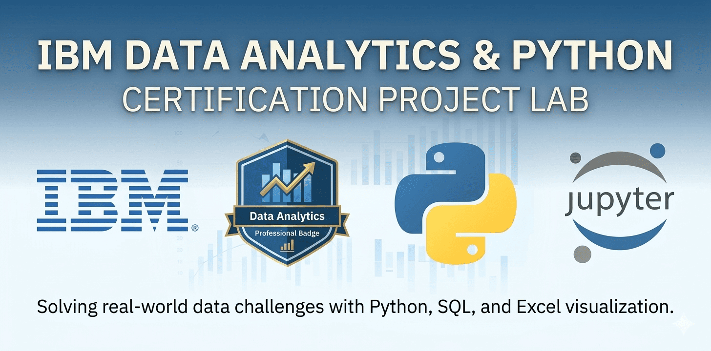

# IBM Data Analytics Professional Certificate 🎓

This repository documents my technical upskilling journey through the IBM Professional Certification. It reflects my active transition into Data Analytics and Automation, combining a robust background in business operations with new, hands-on technical capabilities. 

## 🛠️ Tech Stack & Current Focus

This specialization allows me to build a strong foundation in the data lifecycle, focusing on practical applications for corporate environments:

* **📊 Data Analysis (Excel)**
    * *Applied Skills:* Data Cleaning, Pivot Tables, VLOOKUPs, and Workflow Optimization.
    * *Focus:* Solving bilingual localization challenges and maintaining formula integrity across English/Spanish software environments.

* **🐍 Data Science Foundations (Python)**
    * *Learning Path:* Utilizing Pandas, NumPy, and Matplotlib for data processing and exploratory visualization.
    * *Goal:* Moving from manual data entry to basic script automation and structured data manipulation.

* **🗄️ Database Management & SQL**
    * *Fundamentals:* Understanding relational database structures and writing essential SQL queries.
    * *Business Context:* Applying the 5 V's of Big Data to strategic decision-making and operational scaling.

## 📂 Featured Projects & Case Studies

* **🥖 Bella's Bakery Case Study**
    * *Executive Summary:* Executed an end-to-end inventory and sales analysis for a retail business scenario.
    * *Impact:* Applied structured data cleaning techniques to extract actionable business insights from raw logs.

* **📜 Global Localization Guide**
    * *Documentation:* Created a methodology for managing software localization discrepancies in analytics tools, demonstrating attention to detail and process documentation.

## 🎯 Career Vision: The Business-Tech Bridge

After an extensive and successful career managing complex processes and Customer Experience, I am intentionally pivoting toward the technical execution of these strategies. I am currently integrating:
1.  **Process Automation:** Learning Python and N8N to modernize and scale repetitive workflows.
2.  **Data-Driven Decisions:** Building the foundational skills to analyze data logs and optimize conversion rates.
3.  **Continuous Tech Adoption:** Embracing AI, basic programming, and cyber-awareness to stay at the forefront of digital efficiency.

---
*Bridging Business Operations with Tech & Data Analytics | ✨ 2026 | Remote & Global*
